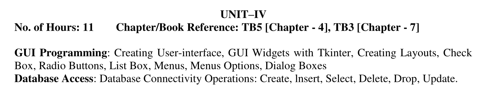

# Data Visualization & Analytics Unit 4 resources

### Syllabus



### Getting started with the notebooks

1. Clone the repository to your local machine

```bash
git clone https://github.com/realKarthikNair/sem6-dvda-unit4-resources/
```

2. Create a virtual environment and activate it (optional but recommended)

```bash
pip install virtualenv
virtualenv .venv
# On Windows
.venv\Scripts\activate
# On Linux or Unix or MacOS
source .venv/bin/activate
```
3. Install the required packages

```bash
pip install -r requirements.txt
```

4. Start the Jupyter notebook server

```bash
jupyter notebook
```

5. You can now use the notebooks!

### repo tree

```
.
├── A. tkinter_introduction.ipynb
├── B. lambda_function_examples.ipynb
├── C. database_connectivity.ipynb
├── D. student_marks_db_system.ipynb
├── PDF exports
│   ├── A. tkinter_introduction.pdf
│   ├── B. lambda_function_examples.pdf
│   ├── C. database_connectivity.pdf
│   └── D. student_marks_db_system.pdf
├── datasets
│   ├── new2.csv
│   └── olympics.csv
├── DB
│   └── student.db
├── images
│   ├── dvda-sem4-syllabus.png
│   └── img.png
├── pyvenv.cfg
├── README.md
├── requirements.txt
├── .gitignore
└── student_data
    ├── creds.csv
    ├── marks.csv
    └── updated.csv


6 directories, 20 files
```

